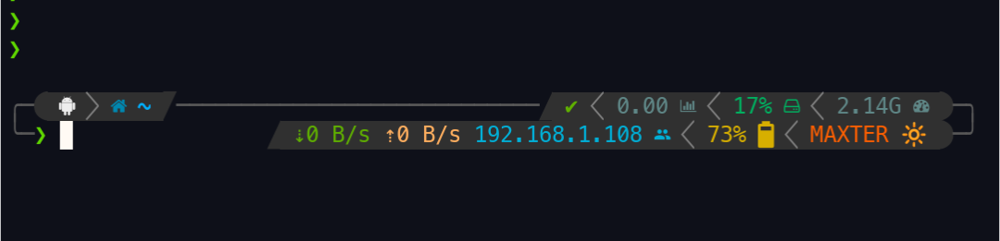

# MAXTER // Version 27.2.B2

**MAXTER** is a professional terminal setup tool designed for **Termux**, **Kali Linux**, **Ubuntu**, **Debian**, **Arch**, and **Fedora**.
 It automatically installs and configures **Zsh**, **Oh-My-Zsh**, the **Powerlevel10k** theme, and **Nerd Fonts** with zero manual prompts.

[](https://mahendraplus.github.io/MAXTER/)

## ✨ Key Features

- **One-Command Setup**: A silent, non-interactive installer for a frictionless experience.
- **Maxter TUI Dashboard**: Type `maxter` to manage settings and bootstrap **React** or **Vue** workflows via Vite.
- **Optimized for Termux**: Custom extra-keys and color schemes tailored for mobile productivity.
- **Industrial Aesthetic**: Powered by Powerlevel10k with sharp, professional configurations.
- **Smart OS Detection**: Automatically applies system-specific patches for all major Linux distributions.

## 🚀 Instant Installation

Run the following command in your terminal to set up MAXTER instantly:

```bash
bash <(curl -fsSL https://raw.githubusercontent.com/mahendraplus/MAXTER/Max/install.sh)
```

## 🚀 Instant Installation


### Settings Dashboard
Simply type `maxter` in your terminal to open the interactive settings menu.

## 📄 License

This project is licensed under the **MIT License**. See the [LICENSE](LICENSE) file for full details.

---
Created with ❤️ by [Mahendra Mali](https://github.com/mahendraplus)
