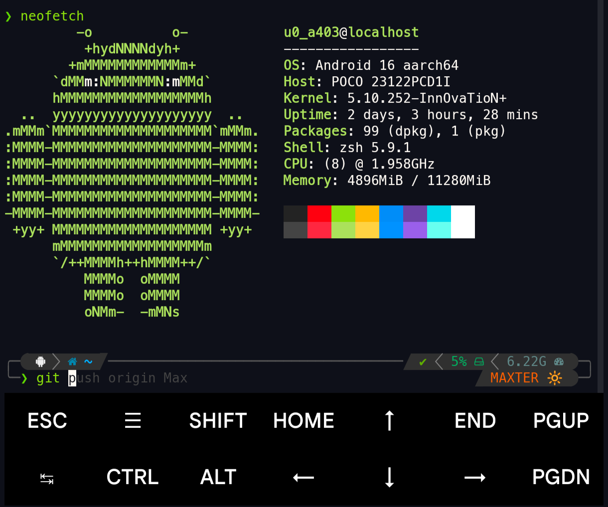
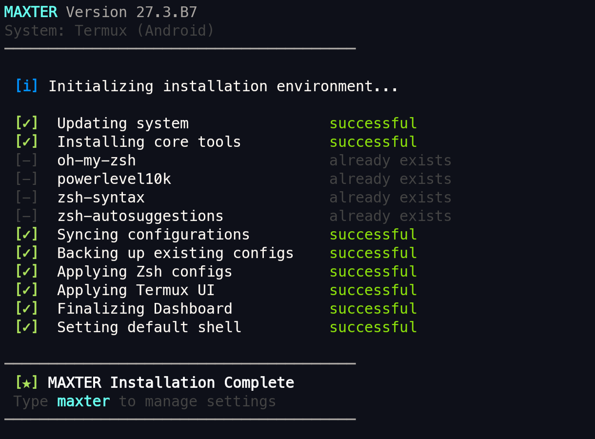
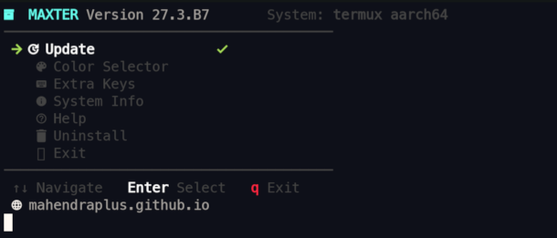
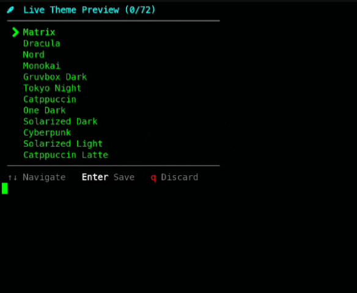
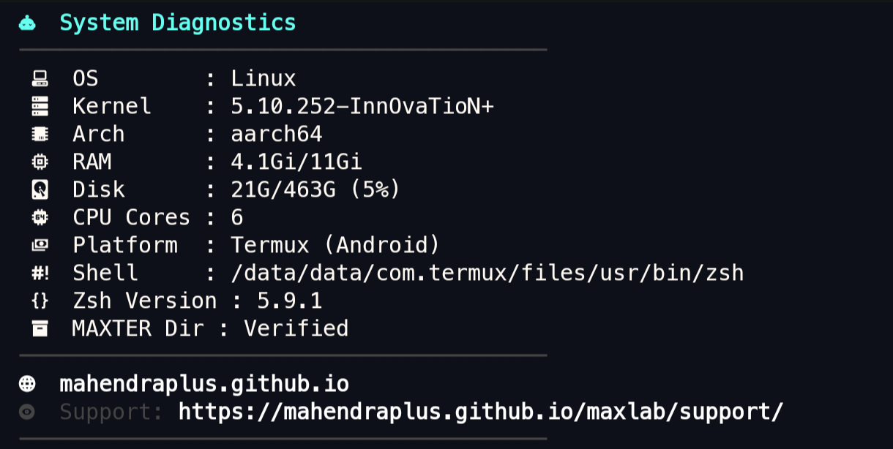

# 🚀 MAXTER // Version 27.3.B10

<div align="center">

[](https://mahendraplus.github.io/MAXTER/)

**A simple and fast terminal setup tool for Termux, Debian, Ubuntu, and Kali Linux**

[](https://mahendraplus.github.io/MAXTER/)
[](LICENSE)
[](https://github.com/mahendraplus/MAXTER)

</div>

---

## 📝 About MAXTER

**MAXTER** is a professional, fast, and elegant terminal setup tool designed for **Termux**, **Kali Linux**, **Ubuntu**, **Debian**, **Arch**, and **Fedora**. It automatically installs and configures **Zsh**, **Oh-My-Zsh**, the **Powerlevel10k** theme, and **Meslo Nerd Fonts** with zero manual prompts. Perfect for developers, students, and ethical hackers who want a clean, stylish, and productive shell experience.

---

## ✨ Key Features

- **⚡ One-Command Setup**: A silent, non-interactive installer for a frictionless experience
- **🎛️ Maxter TUI Dashboard**: Type `maxter` to manage settings and bootstrap **React** or **Vue** workflows via Vite
- **📱 Optimized for Termux**: Custom extra-keys and color schemes tailored for mobile productivity
- **🎨 Industrial Aesthetic**: Powered by Powerlevel10k with sharp, professional configurations
- **🔧 Smart OS Detection**: Automatically applies system-specific patches for all major Linux distributions
- **⚙️ Extensible**: Easy customization and plugin support
- **🔐 Lightweight**: Minimal dependencies with fast installation

---

## 🚀 Quick Start

### Installation

Run the following command in your terminal to set up MAXTER instantly:

```bash
bash <(curl -fsSL https://raw.githubusercontent.com/mahendraplus/MAXTER/Max/install.sh)
```

**Supports:**
- 🤖 Termux
- 🐧 Debian / Ubuntu / Kali Linux
- 🔴 Fedora
- 🔵 Arch Linux

### Settings Dashboard

Simply type `maxter` in your terminal to open the interactive settings menu:

```bash
maxter
```

---

## 📸 Screenshots & Demos

<p align="center">
  
  
</p>

<p align="center">
  
  
</p>

<p align="center">
  
</p>

---

## 🎯 What Gets Installed

✅ **Zsh** - Powerful and extensible shell  
✅ **Oh-My-Zsh** - Community-driven Zsh framework  
✅ **Powerlevel10k** - High-performance, responsive Zsh theme  
✅ **Meslo Nerd Fonts** - Beautiful monospace fonts with icons  
✅ **Essential Plugins** - Pre-configured productivity plugins  

---

## 🔧 Configuration

MAXTER provides a simple command-line interface to customize:

- Theme preferences
- Font selection
- Plugin management
- Workflow templates (React, Vue with Vite)
- Termux-specific settings
- System prompts and aliases

---

## 💡 Use Cases

👨‍💻 **Developers** - Streamline your development environment setup  
🎓 **Students** - Get a professional shell in seconds  
🛡️ **Ethical Hackers** - Pre-configured tools and aesthetics for penetration testing  
📱 **Termux Users** - Optimized for Android terminal emulation  

---

## 📊 Project Statistics

| Language | Percentage |
|----------|-----------|
| Shell | 76.7% |
| JavaScript | 18% |
| HTML | 3.7% |
| CSS | 1.6% |

---

## 🤝 Contributing

We welcome contributions! Here's how you can help:

1. **Fork** the repository
2. **Create** a feature branch (`git checkout -b feature/amazing-feature`)
3. **Commit** your changes (`git commit -m 'Add amazing feature'`)
4. **Push** to the branch (`git push origin feature/amazing-feature`)
5. **Open** a Pull Request

Please ensure your code follows our style guidelines and includes appropriate tests.

---

## 🐛 Issue Reporting

Found a bug or have a suggestion? Please [open an issue](https://github.com/mahendraplus/MAXTER/issues) with:
- Detailed description
- Steps to reproduce
- Your environment (OS, Termux version, etc.)
- Screenshots or logs if applicable

---

## 📄 License

This project is licensed under the **MIT License**. See the [LICENSE](LICENSE) file for full details.

---

## 🙏 Acknowledgments

- [Oh-My-Zsh](https://ohmyz.sh/) Community
- [Powerlevel10k](https://github.com/romkatv/powerlevel10k) by Roman Perepelitsa
- [Nerd Fonts](https://www.nerdfonts.com/) Project
- All our amazing contributors and users

---

<div align="center">

### ⭐ If you find MAXTER useful, please give it a star!

[⬆ back to top](#-maxter--version-273b10)

</div>

---

Created with ❤️ by [Mahendra Mali](https://github.com/mahendraplus)

**Last Updated:** June 2026